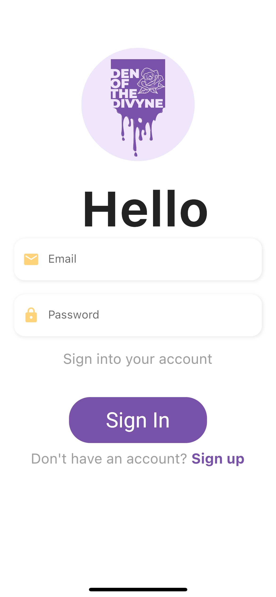
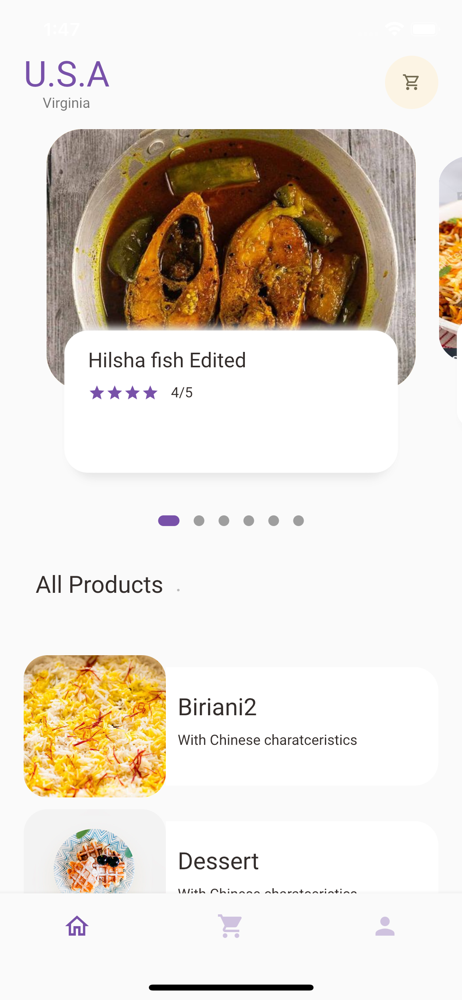
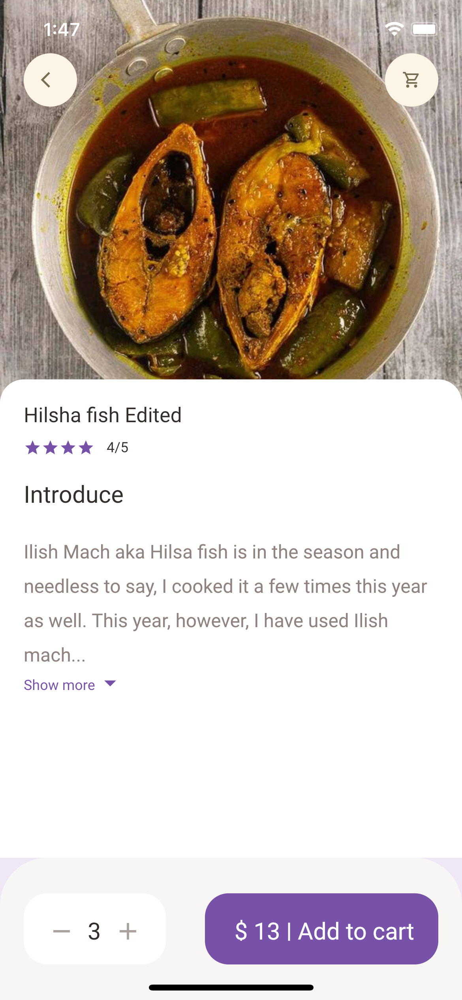
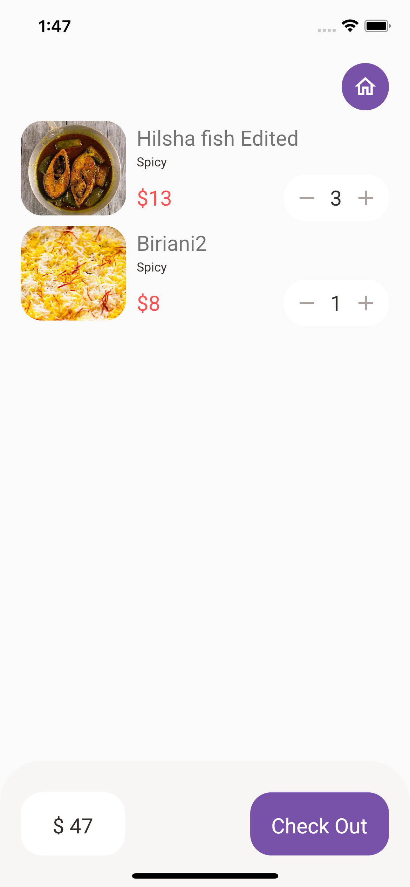
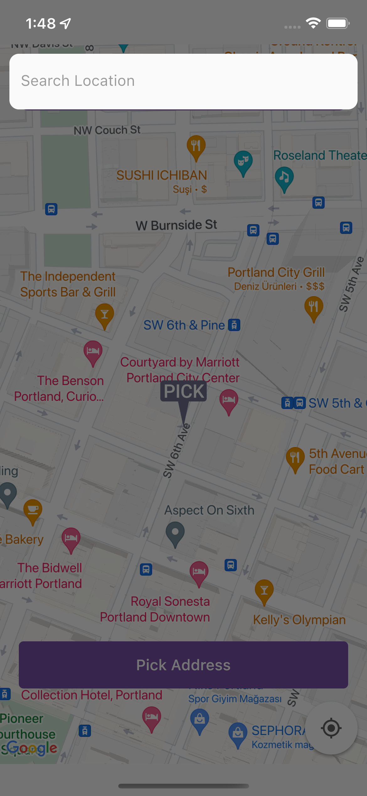
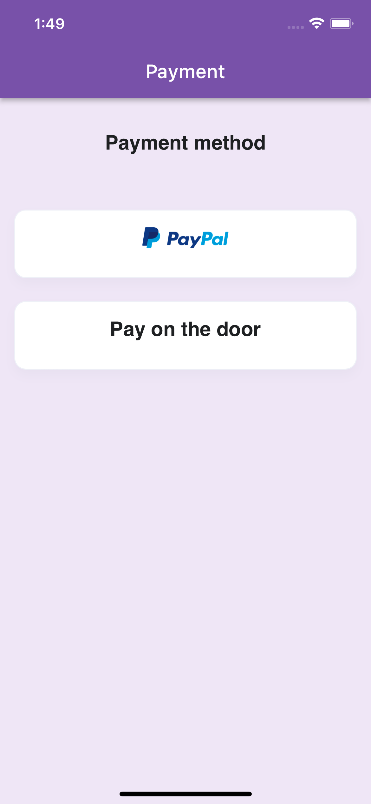
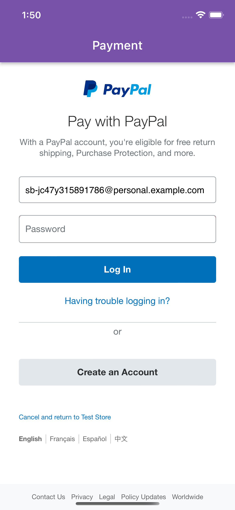
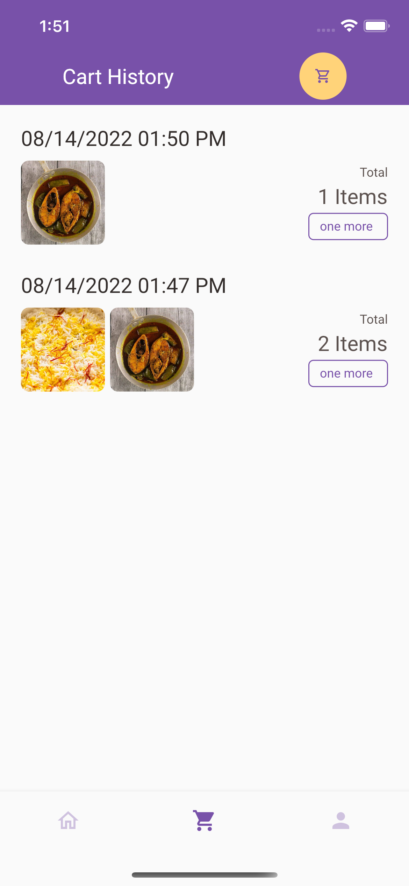
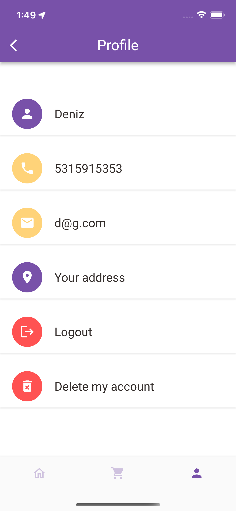

# Food Delivery App Driver Panel

This panel is the user panel of out food delivery app. Users who want to shop from this application 
can register, see the products and give an order to the restaurant. Users can select their addresses from 
the map. They can pay with paypal or select the "pay on the door" option.

## Features
<ul>
    <li>Signup & Login & Delete Account</li>
    <li>See the recommended and the popular food selected by the restaurant</li>
    <li>See food's detail and price & add to chart</li>
    <li>Edit chart & proceed with the payment</li>
    <li>Select address from maps or enter manually</li>
    <li>Pay with PayPal or pay on the door</li>
</ul>

## Images from the app

This is the welcoming screen for users where they can signup or login

 
 

When users sign in to the app, they see this page where they can see the popular and the recommended foods. 

 
 

When users press on a product, they are navigated to this page where they can see the details of the food. 
They can see the price of the food and add it to their chart  

 
 

This is the chart page. After selecting some products, users can see their charts and edit it. When they
are done, they can order their chart

 
 

Users can select their current addresses from the maps.
So the drivers can know where they will be delivering the order.

 
 

Users have two options for paying. They can either pay with PayPal (for which we have used the API of the PayPal)
 or they can prefer to pay on the door.

 
 

This is the integrated PayPal payment page.

 
 

This is the chart history page where users can see their previous orders and if they wish, can reorder those orders.

 
 

This is the profile page where users can see their information.

## Getting Started

coming soon...

